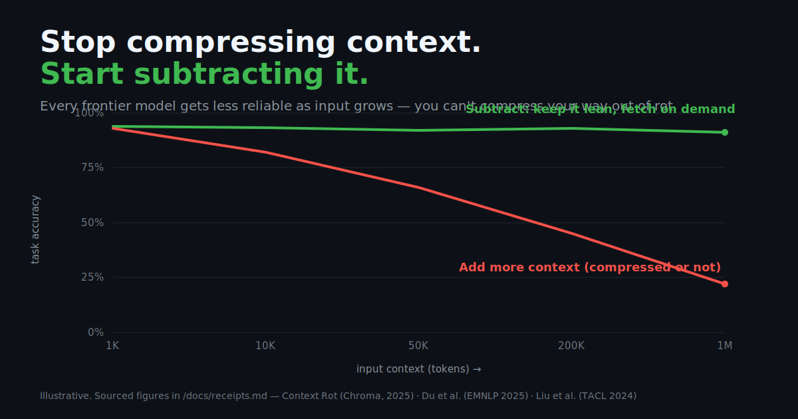

<!--
  Before you publish:
  1. Replace every OWNER/REPO below with your GitHub path (e.g. yourname/subtraction).
  2. The hero image lives at assets/context-rot.svg — GitHub renders it inline.
  3. Launch copy is in /launch. Receipts (the dunk-shield) are in /docs/receipts.md.
-->

<div align="center">

# Subtraction

### Stop compressing your context. Start subtracting it.



The entire industry is racing to **compress** the context you feed an LLM.
They're optimizing the wrong variable. The bottleneck was never token *count* —
it's **context rot**, and you cannot compress your way out of rot.

[](LICENSE)
[](CONTRIBUTING.md)
[](https://github.com/OWNER/REPO)

</div>

---

## TL;DR

- **The wrong fix —** prompt/token compression (LLMLingua, token-compressors, "caveman speak," the classical-Chinese trick). All of it shrinks the *payload*.
- **The law —** every frontier model gets *less reliable* as input grows. Measured, peer-reviewed, reproducible. ([the receipts ↓](#the-receipts))
- **The cure —** **subtraction** (put less in front of the model) + **think-in-code** (let the agent fetch the rest *on demand*, so it never hits the context window at all).

> You can squeeze a 500K-token mess into 100K tokens. It is still a mess, and the model still rots on it.

---

## The whole field is optimizing the wrong variable

Open GitHub and count the repos promising to **save you tokens**: semantic compressors that "preserve meaning," tools that strip "predictable grammar," prompts rewritten in their densest possible form — even a viral genre that writes context in *Classical Chinese* because a single character carries an entire English clause.

They all answer the same question: **"How do I fit *more* into the window?"**

That question is the bug. More-but-smaller is still more.

## The law: context rot

The research is no longer ambiguous. Models do **not** use their context uniformly, and they degrade as it grows — regardless of how few tokens you've squeezed it into:

| Finding | What it says | Source |
|---|---|---|
| **Context Rot** | 18 frontier models (GPT-4.1, Claude 4, Gemini 2.5, Qwen3) *all* get less reliable as input length grows. Context is not used uniformly. | Hong, Troynikov & Huber — Chroma, 2025 |
| **Length alone hurts** | Performance drops **13.9%–85%** as input grows **even with *perfect* retrieval** — even when every irrelevant token is masked out. It's the length itself. | Du et al. — *Findings of EMNLP 2025* |
| **Lost in the Middle** | Models attend to the start and end of context and go blind in the middle — a U-shaped curve, ~30%+ accuracy swings by position. | Liu et al. — *TACL 2024* |

Read that middle row again. **Perfect retrieval still rots.** That is the line that kills the compression thesis: if shrinking *irrelevant* tokens to zero doesn't save you, then losslessly compressing *relevant* ones won't either. Worse — lossy "semantic" compression is exactly where negations, conditionals, and the one number that flips the answer go to die.

You cannot compress your way out of context rot. You can only **subtract**.

## The cure, part 1 — Subtraction

A discipline, not a tool. The defaults:

1. **Default to less.** Every token you add is a token the model can drown in. Justify inclusions, not exclusions.
2. **Optimize relevance density, not token count.** 4K of pure signal beats 40K of compressed maybe.
3. **Never fill the middle.** If it has to be there, put it at the edges. The middle is where attention goes to die.
4. **One task, one minimal context.** Don't carry the whole session. Rebuild a tight context per step.
5. **Delete on a schedule.** Memory that only grows, rots. Prune aggressively; a small, fresh context beats a large, stale one every time.

## The cure, part 2 — Think in code

The frontier version of subtraction: stop *handing* the model data, and let it **write code to go get exactly the slice it needs.** Intermediate results stay in the execution environment — only what the model explicitly returns ever touches the context window.

```python
# Don't: dump 50 files / 200K tokens into context and pray.
context = read_everything(repo)        # ← rots
answer  = model(context, question)

# Do: hand the model tools, let it fetch on demand.
# The 200K never enters the window — only the 200-token answer comes back.
answer  = agent.run(question, tools=[grep, read_lines, run_sql])
```

This isn't hypothetical. Anthropic's own guidance moved this way: present servers as **code APIs** the agent calls, so "intermediate results stay in the execution environment by default, and the agent only sees what is explicitly logged or returned." ([Code execution with MCP](https://www.anthropic.com/engineering/code-execution-with-mcp), 2025). Context pressure becomes a *programming* problem, not a compression one.

## The receipts

Every claim above, sourced and summarized for skimming, lives in **[docs/receipts.md](docs/receipts.md)** — context-rot research, the compression camp it refutes, and the think-in-code primary sources. Found a paper we're missing or a counterexample that bites? **[Open a PR.](CONTRIBUTING.md)**

## FAQ

**"Isn't this obvious?"** The phenomenon is documented; the *practice* isn't. The whole token-saving industry is built on ignoring it. Naming it, sourcing it, and saying *subtract instead of compress* out loud is the point. Full objections, answered: **[docs/faq.md](docs/faq.md)**.

**"So compression is useless?"** No. If compression makes you put *genuinely less* in front of the model, that's subtraction by another name — we're allies. We're against compression-as-**cramming**: shrinking the payload so you can keep over-stuffing the window.

**"Isn't this just RAG?"** RAG is one way to subtract. Think-in-code is a stronger one: the model decides what to pull, when, in the execution environment — instead of you pre-stuffing retrieved chunks back into the prompt (where they rot like everything else).

**"Where's your benchmark?"** We stand on peer-reviewed ones (above) rather than grade our own homework. The Chroma toolkit is even [reproducible](https://github.com/chroma-core/context-rot) — run it against your own setup.

## Contribute

This is a living field guide. Add a receipt, a war story, a counterexample, a subtraction pattern that works. See **[CONTRIBUTING.md](CONTRIBUTING.md)**.

---

<div align="center">

**If this reframed how you think about context, ⭐ it — so the next engineer reaching for a compressor finds this first.**

*Stop compressing. Start subtracting.*

</div>
