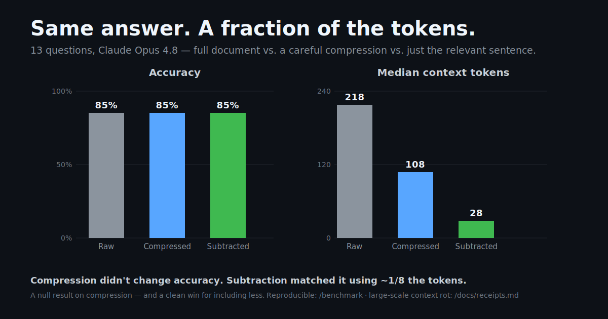
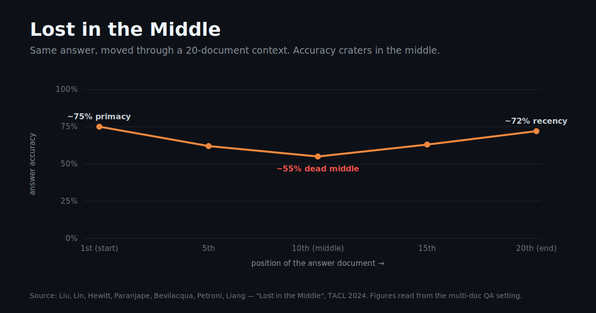
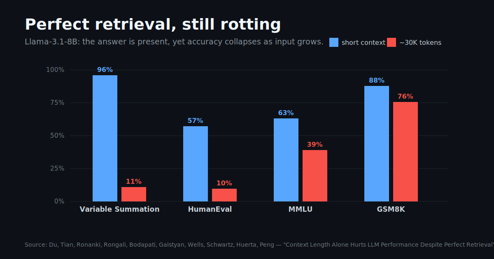

# Subtraction

### Same answer. A fraction of the tokens.

The reflex is to cram everything into the context window — and when it won't fit, to
**compress** it so more does. We ran the controlled test: **compression didn't change
accuracy at all.** What changed everything was *how much we included*. The relevant slice
gave the same answer at **~1/8 the tokens** — and at scale, the research shows large
contexts get *less* reliable, not more.

The lever isn't how you pack the context. It's how little you put in it.

---

## TL;DR

- **Compression is a no-op for accuracy.** In our controlled test, full / compressed / subtracted contexts all scored the **same** — compression didn't help *or* hurt.
- **Subtraction wins on cost, not magic.** Giving the model just the relevant sentence matched full-document accuracy at **~1/8 the tokens** (median 28 vs 218).
- **Scale is the real enemy.** Peer-reviewed work shows every frontier model gets less reliable as input grows — even with *perfect* retrieval. ([receipts ↓](#the-part-thats-not-up-for-debate-scale))
- **So: include less, fetch on demand.** Subtraction + [think-in-code](#the-cure-subtract), not a better compressor.

---

## The reflex: stuff it, then compress it

Open GitHub and count the repos promising to **save you tokens**: semantic compressors, prompts rewritten to their densest form, even writing context in Classical Chinese for the character density. They all answer one question — *"how do I fit more in?"*

We started this repo believing the sharper version: *compression actively throws away the details your task depends on.* Then we tested it. We were wrong.

## We measured it — and it changed our mind

Same question, same model (Claude Opus 4.8), three context treatments: the **full document**, a **careful compression** (Opus told to compress while preserving all important info), and **subtraction** (just the one relevant sentence). 13 questions, each answer hinging on a specific buried detail — an exception, an override, a negation. Blind, exact-match scored.

| | Accuracy | Median context tokens |
|---|:---:|:---:|
| **Raw** (full document) | 85% | 218 |
| **Compressed** (~50%) | 85% | 108 |
| **Subtracted** (relevant slice) | **85%** | **28** |

**A null result on compression.** It neither helped nor hurt — the careful summary kept the details, and accuracy didn't move. The one thing that collapsed was the token bill: **subtraction matched full-document accuracy on ~1/8 the tokens.** The whole run is reproducible against your own model and docs in **[/benchmark](benchmark/)** — including the cases where it *didn't* work (over-subtract and you cut the bridge a question needs).

> We're publishing the result that killed our own headline. That's the point — if a claim can't survive its own benchmark, it shouldn't be in your prompt either.

## The part that's not up for debate: scale

Our test ran on short documents. The reason to care about subtraction is what happens when context gets *long* — and here the literature is unambiguous.

**Same fact, different position — the middle is a dead zone:**

**Even with *perfect* retrieval, length alone degrades accuracy:**

Accuracy drops **13.9%–85%** as input grows **even when retrieval is perfect** (Du et al., EMNLP 2025). Chroma found the same across 18 frontier models. You don't compress your way out of that — a shorter-but-still-huge context still rots. You **subtract**.

## The cure: subtract

A discipline, not a tool:

1. **Default to less.** Justify what you include, not what you cut. Most of your context is dead weight.
2. **The relevant slice ≈ full accuracy at a fraction of the cost.** Spend your effort finding it, not packing everything.
3. **Don't over-subtract.** Our own test caught this: cut too far and you remove the sentence a question depends on. Subtract to the *relevant unit*, not the shortest string.
4. **Never bank on the middle.** If something must be there, put it at the edges.
5. **Think in code.** The scalable form of subtraction: instead of *handing* the model data, let it **write code to fetch the exact slice it needs**, so the bulk never enters the window. Anthropic's own guidance moved this way — present servers as code APIs so "intermediate results stay in the execution environment; the agent only sees what is explicitly returned." ([Code execution with MCP](https://www.anthropic.com/engineering/code-execution-with-mcp), 2025).

## The receipts

Every external claim, sourced with exact figures, is in **[docs/receipts.md](docs/receipts.md)**. Our own run — including its limitations — is in **[/benchmark](benchmark/)**. Found a paper we're missing, or a counterexample? **[Open a PR.](CONTRIBUTING.md)**

## FAQ

**"So compression is useless?"** No — it's just not the lever. It saves tokens without changing accuracy, which is fine. But it can't beat subtraction on tokens, and it can't undo the rot that comes from a still-large context. Full answers: **[docs/faq.md](docs/faq.md)**.

**"Isn't 'just send the relevant part' obvious?"** The principle is. The *practice* is the opposite — we dump and compress by reflex. And the catch is real: subtraction assumes you can *find* the relevant slice. That's why think-in-code (let the model fetch it) matters.

**"N=13 is tiny."** Correct, and we say so. It's a demonstration you can re-run, not a leaderboard. The heavy, peer-reviewed evidence for the scale claim is in the [receipts](docs/receipts.md).

## Contribute

A living field guide. Add a receipt, a counterexample, a subtraction pattern, a war story. See **[CONTRIBUTING.md](CONTRIBUTING.md)**.

---

**If this reframed how you think about context, ⭐ it — and go delete some.**

*Same answer. A fraction of the tokens.*

